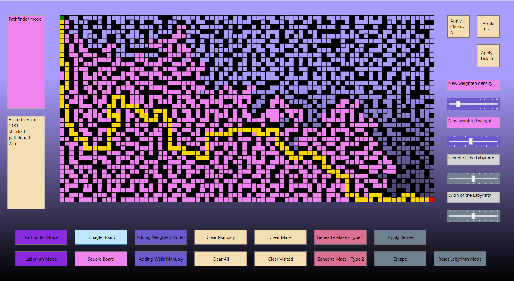
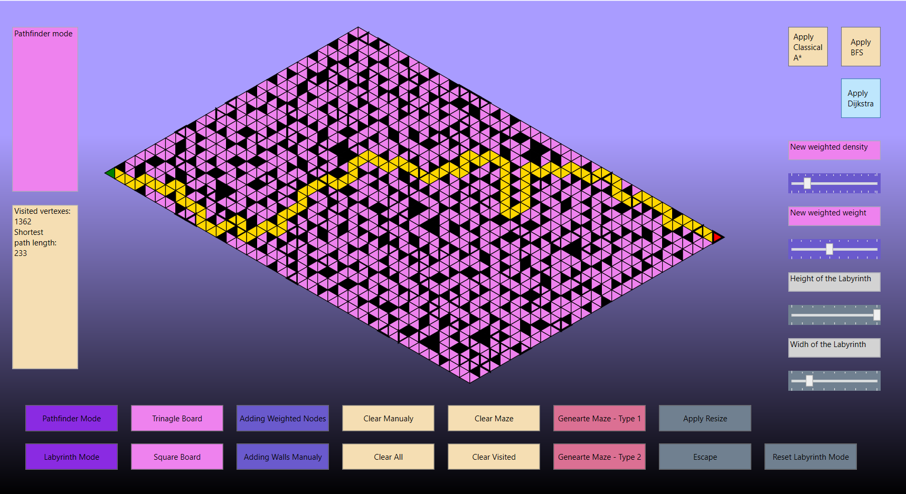
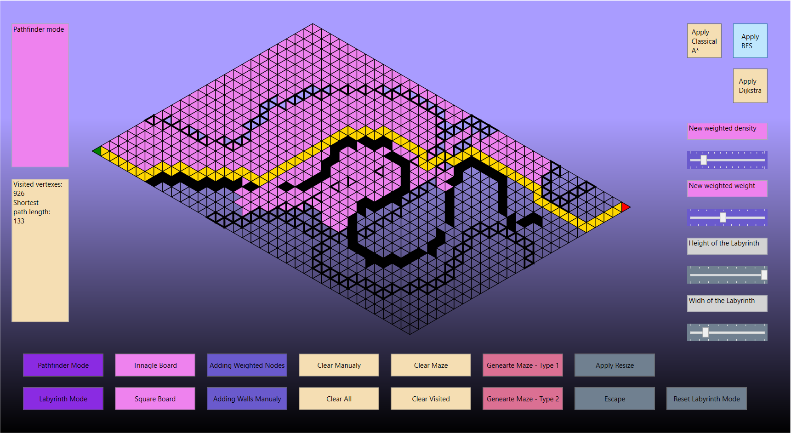
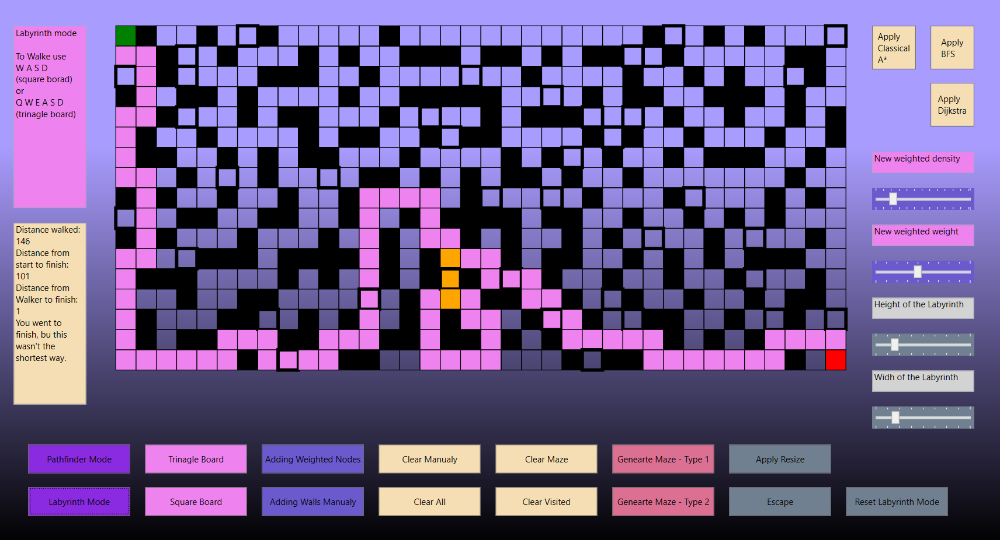

# Pathfinding-Visualizer

## About the project

This is my first C# project. Earlier, I wrote something similar in Java, it was my second project for the OO Programming Course. This application is the inspiration for the project: https://clementmihailescu.github.io/Pathfinding-Visualizer/. 
I thought that rewriting this project from Java into C# is a good way to learn a programming language that was new to me.

## Technologies used

* C# language and .NET framework
* Windows Presentation Foundation (WPF)

## Basic functionality

* generating a labyrinth using one of the algorithms for it
* some fields that you can pass through can have a higher cost (weight) 
* using one of the algorithms to find the shortest passage in the maze
* choice of board grid - fields can be square or triangular
* resizing  the board
* drawing the maze yourself
* go through the maze alone in a special mode

## Screenshots

 
 

## Development perspectives

* add more algorithms for finding the path
* add one more algorithm to generate the maze
* add the ability to stop the finding
